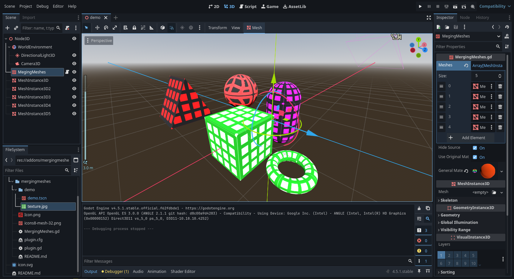

# Merging Meshes Godot
Optimize your 3d scenes with Merging Meshes. This mini-addon is the basis of **my new [powerful addon](https://github.com/EmberNoGlow/Godot-SceneBuilder)**.

## What is it?
Merging Meshes is an add-on for **Godot 4** that is designed to **optimize scenes** with a large number of **MeshInstance3D** and **procedural geometry**.

## How it works?
Meshes are combined by merging MeshInstance3D using SurfaceTool (append_from method). This allows you to combine an **unlimited number of meshes into one**, resulting in a **HUGE GROWTH in perfomance** as **only one drawing call is made instead of thousands**

## Features

1. UV and material support.
2. Clear and minimal code.
3. Convenient API - you can use this code in your tools!

## Usage

1.  Download and enable the addon (Make sure that the folder is located in `addons`).
2.  Add a `MergingMeshes` node to your scene.
3.  In the Inspector panel, add your `MeshInstance3D` nodes to the `meshes` parameter.
4.  Optional: Assign a `Material3D` to the `GeneralMaterial` parameter to set the material for the merged mesh or use **Original mesh materials**.
5.  Recommended: Keep the `HideSource` parameter enabled to automatically hide the original `MeshInstance3D` nodes.

## About

This mini-add-on is a component of a [larger add-on](https://github.com/EmberNoGlow/Godot-SceneBuilder). Check out my [profile](https://github.com/EmberNoGlow) to find more projects!

## Screenshot

## Did you like the high FPS?
Consider **starring** this repository to make it easier for others to **find it**.

Article on **[Dev.to](https://dev.to/embernoglow/optimize-your-godot-4-scenes-with-merging-meshes-4eib)**.

Get on **[Asset Library](https://godotengine.org/asset-library/asset/4538)**.
